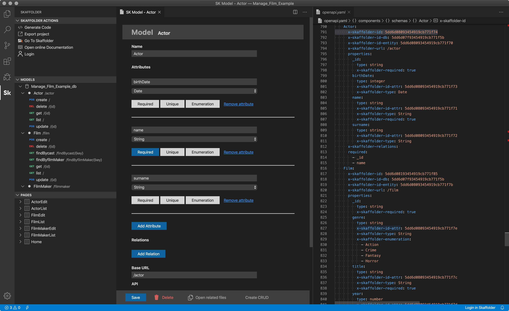

	
	

	

# Skaffolder Generator

This extension allows to interact with the [Skaffolder](https://www.skaffolder.com) platform.

It allows to create web and mobile application s starting from the technical documentation of database models, APIs and pages.

The documentation can be defined from the [Skaffolder web interface](https://app.skaffolder.com) having a free Skaffolder account or from the openapi.yaml file that extends the OpenAPI 3.0 standards. This exension allows to edit the openapi file from a visual interface according to the Skaffolder's standards.

## Features

- Skaffolder Login
- Create project
- Generate project
- Export to Skaffolder
- Add and edit model
- Add and edit page
- Add and edit API
- Add and edit database

## Requirements

Optional free Skaffolder account:
https://skaffolder.com/register

## Extension Settings

- `skaffolder.endpoint`: configure link with on-prem Skaffolder platform
- `skaffolder.endpointDocs`: configure link with on-prem Skaffolder platform for displaying documentation

More info on Skaffolder on-prem for enterprises [here](https://skaffolder.com/enterprise/overview).

Get Skaffolder on-premise from:

- [Docker Hub](https://hub.docker.com/_/skaffolder-enterprise)
- [Google Marketplace](https://console.cloud.google.com/marketplace/details/skaffolder-public/skaffolder-enterprise)
- [AWS Marketplace](https://aws.amazon.com/marketplace/pp/B07SW4GPFY)
- [DigitalOcean Marketplace](https://marketplace.digitalocean.com/apps/skaffolder-enterprise)
